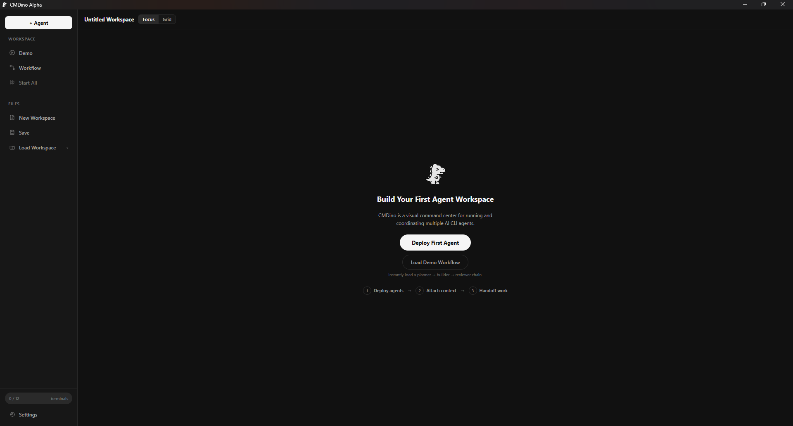
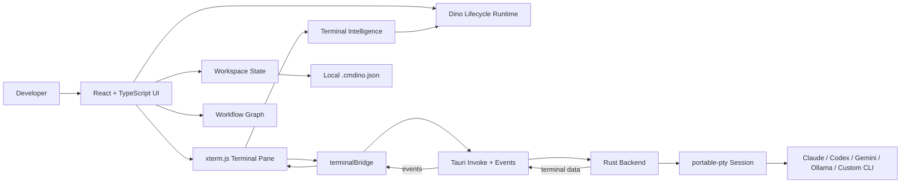

# CMDino

<p align="center">
  <strong>Local-first desktop command center for multi-agent AI CLI workflows.</strong>
</p>

<p align="center">
  Run Claude, Codex, Gemini, Ollama, and custom shell agents as real local terminals with a visual orchestration layer around them.
</p>

<p align="center">
  
  
  
  
  
  
</p>

CMDino is a native desktop workspace for developers who run several AI command-line agents at once. It launches real local CLI processes, renders each one in a managed terminal pane, and adds the missing coordination layer: presets, attachable brain files, handoff, Auto Forward Lite, workflow visibility, readiness checks, workspace persistence, session events, and dino-based lifecycle feedback.

CMDino is alpha software. It is not a public SaaS product, billing system, autonomous workflow engine, IDE plugin, or chatbot wrapper.

## Current Milestone

| Item | Status |
| --- | --- |
| Milestone | CMDino V1.9 Alpha |
| Package version | `0.1.0-alpha.1` |
| Installer version | `0.1.0` |
| Release posture | Private alpha release prep |
| QA posture | Build, Tauri build, release EXE smoke, and packaged smoke notes documented |
| Access/payment | No public alpha access, account gate, license gate, or payment flow yet |

## Media

Release media targets:

| Asset | Path | Current state |
| --- | --- | --- |
| Hero demo image | `docs/media/hero-demo.png` | Present |
| Main workspace screenshot | `docs/screenshots/workspace-main.png` | Present |
| Deploy agent screenshot | `docs/screenshots/deploy-agent.png` | Present |
| Workflow view screenshot | `docs/screenshots/workflow-view.png` | Present |




## What CMDino Is

CMDino is a local desktop command center for AI-assisted development. Each agent gets a name, command, working directory, dino identity, terminal pane, attachments, lifecycle state, and workflow context.

It keeps your preferred tools in place. A preset can launch `claude`, `codex`, `gemini`, `ollama`, or a custom shell command, provided the tool is installed and authenticated on the machine.

CMDino currently provides:

- A Tauri desktop app with a real Rust PTY backend.
- Multi-terminal workspace management.
- Manual orchestration for agent-to-agent handoff.
- Local JSON workspace save/load.
- Local settings and session event history.
- Dino lifecycle feedback for terminal state and identity.

## Why It Exists

Multi-agent CLI work gets messy quickly: too many tabs, unclear agent identity, manual copy/paste handoffs, lost context, and no visual process state. CMDino keeps the local CLI workflow, but makes it visible and manageable from one desktop workspace.

The product promise is intentionally narrow: orchestrate real local tools without turning CMDino into a cloud wrapper.

## Current Features

| Area | Current behavior |
| --- | --- |
| Native app | Tauri v2 desktop shell with Windows release artifacts |
| Terminal runtime | Rust `portable-pty` spawn, write, resize, kill, and event bridge |
| Terminal UI | xterm.js panes with focus/grid views, copy/log controls, restart, and kill |
| Agent presets | Claude Planner, Codex Builder, Gemini Reviewer, Ollama Worker, Custom Agent |
| Preset brains | Markdown role files attached to preset agents and sent only by explicit user action |
| Custom attachments | `.md` and `.txt` attach, preview, remove, and send |
| Handoff | Capture selected or recent output, edit it, send it to another running agent, and record a link |
| Auto Forward Lite | Forward cleaned recent output to a selected or linked target |
| Workflow graph | Visualizes directional handoff/forward links and supports link removal |
| Workspace files | Save/load local `.cmdino.json` workspace configs with schema validation |
| Agent management | Edit label, command, cwd, kind, dino, and attachments after deploy |
| Readiness checks | Validate cwd and executable availability before start/restart/start all |
| Session History | Local event timeline for lifecycle and orchestration actions, not full terminal transcripts |
| Dino lifecycle | Egg, hatch, running, scan, dash, success, handoff, error, and dead visual states |
| Settings | Theme, animation speed, dino scale, terminal font scale, onboarding reset |
| Packaging resources | `.agents` and `public/preset-brains` bundled as Tauri resources |

## Tech Stack

| Layer | Stack |
| --- | --- |
| Desktop runtime | Tauri v2 |
| Frontend | React 18, TypeScript, Vite |
| Terminal renderer | xterm.js, xterm fit addon |
| Native backend | Rust |
| PTY runtime | `portable-pty` |
| Persistence | Local JSON workspace files, localStorage settings/history |
| Assets | Dino sprite strips loaded through a centralized manifest |

## Architecture Overview



Architecture rules:

- Dino runtime never spawns terminals.
- Runtime PTY state is separate from persisted workspace config.
- Terminal input/output goes through the terminal bridge and Tauri commands.
- Rust owns native capabilities; product UX stays in the frontend.
- Workspaces store configuration, not live sessions, secrets, or scrollback.

See [docs/ARCHITECTURE_RULES.md](./docs/ARCHITECTURE_RULES.md).

## Agent Presets

| Preset | Default command | Role | Default brain |
| --- | --- | --- | --- |
| Claude Planner | `claude` | Break requests into plans and scopes | `CLAUDE.md` |
| Codex Builder | `codex` | Implement scoped patches | `CODEX.md` |
| Gemini Reviewer | `gemini` | Review architecture, risks, UX, and tests | `GEMINI.md` |
| Ollama Worker | `ollama run llama3` | Local/offline assistant work | `OLLAMA.md` |
| Custom Agent | User-defined | Any local shell process | None |

Preset agents depend on local CLI availability. If a command or working directory is unavailable, readiness checks block launch with a user-facing error.

## Preset Brains

Preset brains are markdown role files stored under `.agents/` with fallback bundled copies under `public/preset-brains/`.

CMDino shows preset brains as attachments after deploy. It does not silently inject them into a terminal. The user previews and sends them explicitly, keeping context transfer intentional and auditable.

## Handoff / Auto Forward

Manual handoff is the controlled path:

1. Capture selected terminal text or recent terminal lines.
2. Edit the captured text in the handoff modal.
3. Send it to another running agent.
4. Record a directional workflow link.

Auto Forward Lite is the fast path. It forwards the latest cleaned output block to a selected or linked target. It works best with selected text or line-oriented CLI output; raw TUI output can include prompt/control noise.

## Workflow Graph

The Workflow panel visualizes links created by handoff and forward actions. It helps users see which agent has sent context to another agent, how often, and whether a link should be removed.

This is link visualization, not visual workflow authoring. Drag/drop workflow building is on the roadmap and is not implemented yet.

## Session History / Event Timeline

Session History is a local event timeline. It records actions such as agent creation, terminal start/restart/kill/exit/error, attachment send, handoff, forward, workspace save, and workspace load.

It does not store full terminal transcripts or persistent scrollback. Use per-pane log/copy controls during a session when full terminal output is needed.

## Dino Lifecycle UX

Each terminal pane owns a dino lane. The dino acts as an agent identity marker and terminal state indicator.

| State | UX meaning |
| --- | --- |
| Egg / hatch | Agent created and terminal spawn transition |
| Patrol / dash | Active output or heavier processing |
| Scan | Review or analysis-like activity |
| Jump / kick | Success or handoff signal |
| Hurt / dead | Error, exit, or killed process |

See [docs/DINO_ASSET_INTEGRATION_SPEC.md](./docs/DINO_ASSET_INTEGRATION_SPEC.md).

## Installation / Development

Prerequisites:

- Node.js 18+
- npm
- Rust stable
- Tauri v2 prerequisites
- WebView2 Runtime on Windows
- Microsoft C++ Build Tools on Windows
- Any AI CLIs you want to run: `claude`, `codex`, `gemini`, `ollama`, etc.

Install dependencies:

```powershell
npm install
```

Run the desktop app in development:

```powershell
npm run tauri:dev
```

Frontend-only preview:

```powershell
npm run dev
```

Frontend-only preview does not provide the real PTY runtime. Use Tauri dev/build when testing terminal execution.

## Packaging / Build

Frontend production build:

```powershell
npm run build
```

Desktop production build:

```powershell
npm run tauri:build
```

Current Windows outputs:

```text
src-tauri/target/release/cmdino.exe
src-tauri/target/release/bundle/nsis/CMDino_0.1.0_x64-setup.exe
src-tauri/target/release/bundle/msi/CMDino_0.1.0_x64_en-US.msi
```

Quick local release EXE run:

```powershell
.\src-tauri\target\release\cmdino.exe
```

Packaging must preserve:

- `.agents/**/*`
- `public/preset-brains/**/*`

## QA Status

The current alpha QA pass is tracked in [docs/QA_REGRESSION.md](./docs/QA_REGRESSION.md).

Documented status:

- `npm.cmd run build`: PASS.
- `npm.cmd run tauri:build`: PASS.
- Release EXE launch smoke: PASS.
- Windows MSI and NSIS artifacts generated.
- Full interactive MSI/NSIS reinstall flow remains a release checklist item.

## Known Issues

Known alpha limitations are tracked in [docs/KNOWN_ISSUES.md](./docs/KNOWN_ISSUES.md).

Important notes:

- Session History logs events, not full terminal transcripts.
- Auto Forward Lite can be noisy with raw TUI output.
- Drag/drop workflow authoring is not implemented.
- CLI execution depends on locally installed and authenticated tools.
- No cloud sync, accounts, team collaboration, public access, payment gate, or license gate.
- Installer QA is currently Windows-focused.

## Roadmap

Near-term release prep:

- Capture any final launch media still needed.
- Complete installer smoke on release artifacts.
- Audit README links and release checklist.
- Decide license/release wording before any broader distribution.

Product roadmap:

- Drag/drop workflow builder.
- Richer session memory beyond event history.
- Memory brief generator for compact handoff context.
- Stronger terminal output cleaning for forward/handoff.
- Workflow templates and import/export packs.
- Release/licensing path for a paid indie tool.

## License Note

No license file has been published yet. Until a license is added, treat this repository as private and all rights reserved. Public access, paid access, redistribution, and commercial terms are not defined yet.

## Development Rule

Keep the local-first PTY model intact. CMDino should launch and orchestrate real local tools instead of replacing them with a cloud wrapper.
