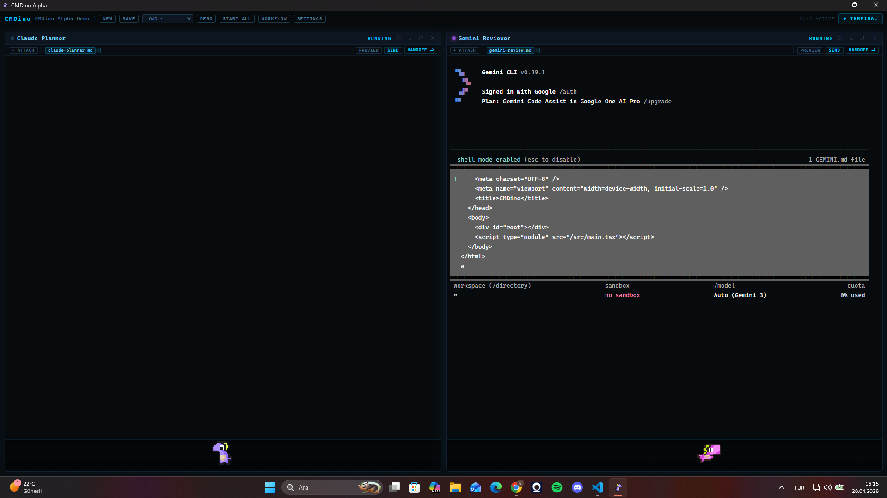
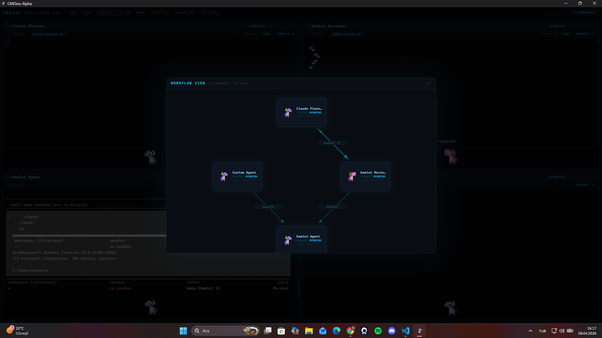
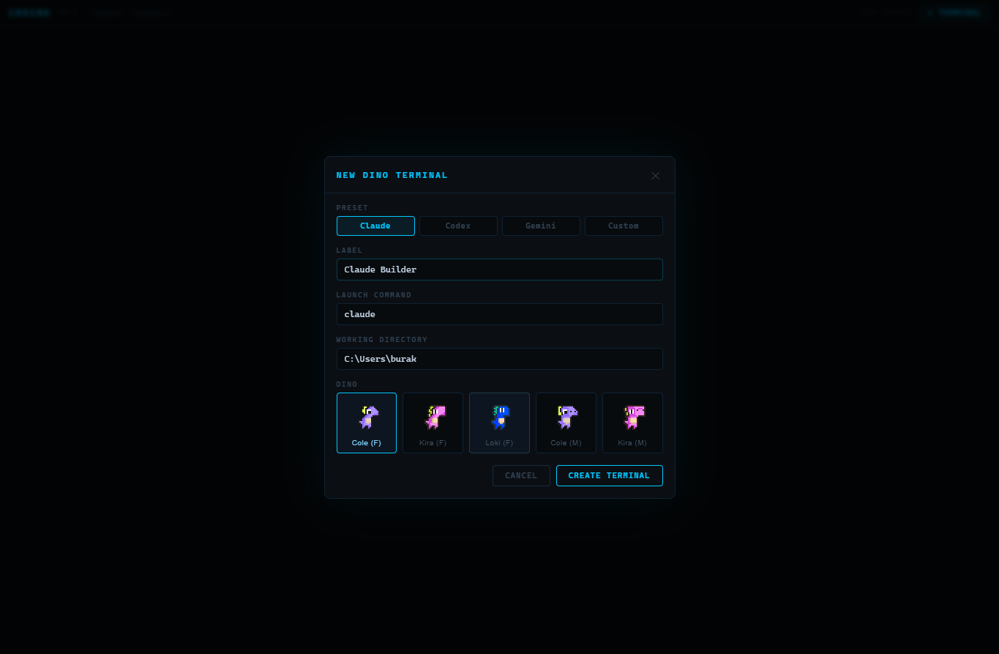
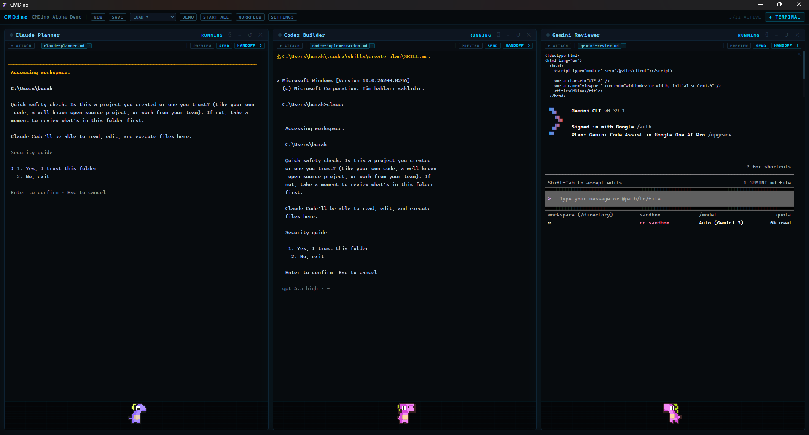
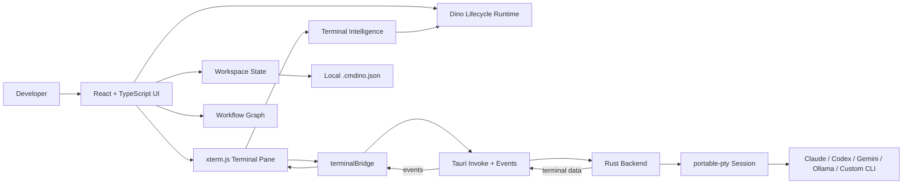

# CMDino

> A local-first desktop command center for running multiple AI CLI agents in parallel.

<p align="center">
  
  
  
  
  
  
</p>

CMDino is a native desktop workspace for developers who use several AI coding tools at once. It launches real local CLI processes, renders them as managed terminal panes, and adds orchestration features around them: preset roles, attachable brain files, handoffs, workflow mapping, readiness checks, workspace persistence, and visual lifecycle feedback.

It is not a chatbot wrapper. The agents are still your local tools: `claude`, `codex`, `gemini`, `ollama`, or any custom shell command.

## Current Alpha

CMDino is currently in **V1 Alpha**. The app is usable for local multi-agent terminal workflows, but installer QA, edge-case hardening, and broader platform testing are still in progress.

Working in this alpha:

| Area | Status |
| --- | --- |
| Native desktop shell | Tauri v2 app with Windows installer output |
| Real terminal runtime | Rust `portable-pty` process manager |
| Terminal UI | xterm.js panes with copy, logs, restart, kill, focus, and grid modes |
| Agent presets | Claude Planner, Codex Builder, Gemini Reviewer, Ollama Worker, Custom Agent |
| Preset brains | Role markdown files attached on deploy and sent only when the user presses SEND |
| Custom attachments | `.md` and `.txt` path attach, preview, remove, and send |
| Handoff flow | Capture terminal output, edit it, send it to another running agent |
| Auto forward lite | Forward cleaned recent output to a linked or selected target |
| Workflow view | Directional handoff graph with link counts and removable edges |
| Workspace files | Save/load local `.cmdino.json` workspaces, schema validation, demo workspace |
| Agent management | Post-deploy edit flow for label, command, working directory, dino, kind, attachments |
| Readiness checks | CWD existence and executable availability checks before start/restart/start all |
| Lifecycle visuals | Egg, hatch, running, scan, dash, success, handoff, error, dead states |
| Settings | Theme, animation speed, dino scale, terminal font scale, onboarding reset |
| Packaging resources | `.agents` and fallback `public/preset-brains` bundled as Tauri resources |

## Screenshots

The repository keeps final screenshot slots under `docs/screenshots/`. Replace these with current captures before a public release.

### Main Workspace



(Use a screenshot of the main app with 2-3 running terminals, visible header, terminal tabs, attachment chips, SEND, HANDOFF, FORWARD, and the dino lanes.)

### Workflow View



(Use a screenshot of the Workflow overlay showing Claude, Codex, Gemini, and directional handoff arrows with counts.)

### Deploy Agent



(Use a screenshot of the Deploy Agent modal with preset cards, preset brain checkbox, command field, working directory field, and dino selector.)

### Dino Lifecycle



(Use a screenshot where at least one terminal is running and the bottom dino lane is visible. A good capture shows active output plus a dino state change.)

Optional public launch captures:

- `docs/screenshots/onboarding.png` (Welcome to CMDino modal with Start Empty, Load Demo Workflow, Deploy First Agent)
- `docs/screenshots/settings.png` (Settings panel showing theme, animation speed, dino scale, terminal font scale)
- `docs/screenshots/readiness-error.png` (Agent not ready panel or restart blocked strip)
- `docs/screenshots/agent-edit.png` (Agent settings/edit modal after deployment)

## How It Works

1. Create an agent from a preset or a custom command.
2. CMDino stores the agent as a local terminal config with label, command, CWD, kind, dino identity, and attachments.
3. When started, Tauri asks the Rust backend to spawn a PTY session.
4. Output streams into xterm.js and is analyzed for lifecycle signals.
5. Brain files and user attachments can be previewed and explicitly sent into the live terminal.
6. Handoffs and forwards send captured output to another live terminal and record a workflow edge.
7. Workspaces can be saved and loaded as local JSON. Live PTY state is never serialized.

## Preset Agents

| Preset | Default command | Purpose | Default brain |
| --- | --- | --- | --- |
| Claude Planner | `claude` | Break requests into plans and scopes | `CLAUDE.md` |
| Codex Builder | `codex` | Implement scoped patches | `CODEX.md` |
| Gemini Reviewer | `gemini` | Review architecture, risks, UX, and tests | `GEMINI.md` |
| Ollama Worker | `ollama run llama3` | Local/offline assistant work | `OLLAMA.md` |
| Custom Agent | user-defined | Any shell process | none |

Preset brains are source-controlled under `.agents/` and also bundled as package resources. `public/preset-brains/` remains as a fallback copy for packaged/runtime lookup.

## Core Workflows

### Deploy and start agents

- Click **Deploy Agent**.
- Pick a preset or Custom Agent.
- Confirm label, command, working directory, dino, and brain selection.
- Start the agent from its pane or use **Start All**.
- CMDino validates working directory and executable availability before launch.

### Attach and send context

- Attach a `.md` or `.txt` file to a terminal.
- Preview up to 256 KB before sending.
- Press **SEND** to write the content into the running PTY.
- Preset brain attachments behave the same way: visible, previewable, and user-sent.

### Handoff between agents

- Press **HANDOFF** from a running terminal.
- CMDino captures selected output or recent terminal lines.
- Edit the captured text.
- Send it to another running agent.
- The Workflow view records a directional link.

### Forward recent output

- Use **FORWARD TO** for a faster handoff.
- CMDino captures the latest cleaned output block and writes it to the target terminal.
- If a workflow link already exists, CMDino prefers that linked target.

### Save and load workspaces

Saved workspaces include:

- workspace name
- terminal labels and order
- agent kinds
- launch commands
- working directories
- dino identities
- attachments
- workflow links

Saved workspaces do not include:

- live PTY state
- terminal scrollback
- secrets
- running processes

## Installation

### Prerequisites

Install:

- Node.js 18+
- npm
- Rust stable
- Tauri v2 prerequisites
- WebView2 Runtime on Windows
- Microsoft C++ Build Tools on Windows
- Any AI CLIs you want to run: `claude`, `codex`, `gemini`, `ollama`, etc.

### Development

```powershell
npm install
npm run tauri:dev
```

Frontend-only preview:

```powershell
npm run dev
```

Frontend-only preview does not provide the real PTY runtime.

### Production build

```powershell
npm run build
npm run tauri:build
```

Current Windows build outputs:

```text
src-tauri/target/release/cmdino.exe
src-tauri/target/release/bundle/nsis/CMDino_0.1.0_x64-setup.exe
src-tauri/target/release/bundle/msi/CMDino_0.1.0_x64_en-US.msi
```

Quick local run without installing:

```powershell
.\src-tauri\target\release\cmdino.exe
```

## Repository Structure

```text
.
├─ .agents/                 # Source preset brain files for AI roles
├─ assets/                  # Runtime app icon and dino sprite assets
├─ docs/                    # Architecture notes, product briefs, screenshots
├─ public/
│  ├─ demo-skills/          # Demo attachment files
│  └─ preset-brains/        # Packaged fallback brain files
├─ src/
│  ├─ components/           # App shell, modals, panels, terminal panes
│  ├─ config/               # Presets, demo workspace, dino manifest, themes
│  ├─ dino/                 # Sprite loading and animation runtime
│  ├─ domain/               # Typed domain models and validators
│  ├─ orchestration/        # File preview and preset brain bridge
│  ├─ readiness/            # Agent start validation bridge
│  ├─ state/                # React state hooks
│  ├─ terminal/             # xterm, PTY bridge, lifecycle intelligence
│  └─ workspace/            # Workspace save/load bridge
└─ src-tauri/
   ├─ capabilities/         # Tauri permission capability config
   ├─ icons/                # Bundle icons
   └─ src/                  # Rust PTY, files, readiness, workspace commands
```

Generated or local-only folders such as `dist/`, `node_modules/`, `src-tauri/target/`, `.claude/`, `.playwright-mcp/`, and `outputs/` are ignored.

## Architecture



## Packaging Notes

Packaging needs preset brain files available after installation. CMDino currently handles this in two ways:

- source lookup from `.agents/` during development
- Tauri resource fallback from bundled `.agents/**/*` and `public/preset-brains/**/*`

After creating an installer, verify:

1. Install the app.
2. Load the demo workflow.
3. Preview and SEND each preset brain.
4. Start an agent with a valid CLI.
5. Confirm dino assets render.
6. Use HANDOFF and FORWARD between two running terminals.
7. Save and reload a workspace.

## Alpha Limitations

- The app assumes local CLI tools are installed and authenticated separately.
- Frontend-only Vite preview cannot run real PTY sessions.
- Workspaces restore configuration, not live sessions.
- Installer QA is still focused on Windows.
- There is no cloud sync, remote agent execution, or provider SDK integration.
- No license file has been published yet; treat the repository as all rights reserved until one is added.

## Roadmap

Short term:

- Broader installer verification
- Cleaner screenshot set for public launch
- More explicit onboarding around required CLIs
- Stronger session logs and export options
- Better workflow editing and templates

Later:

- Reusable workflow presets
- Richer local model support
- More configurable readiness checks
- Improved terminal intelligence and state classification
- Optional import/export packs for presets and brains

## Development Rule

Keep the core local-first PTY model intact. CMDino should launch and orchestrate real local tools instead of replacing them with a cloud wrapper.

Read `docs/ARCHITECTURE_RULES.md` before broad architectural changes.
